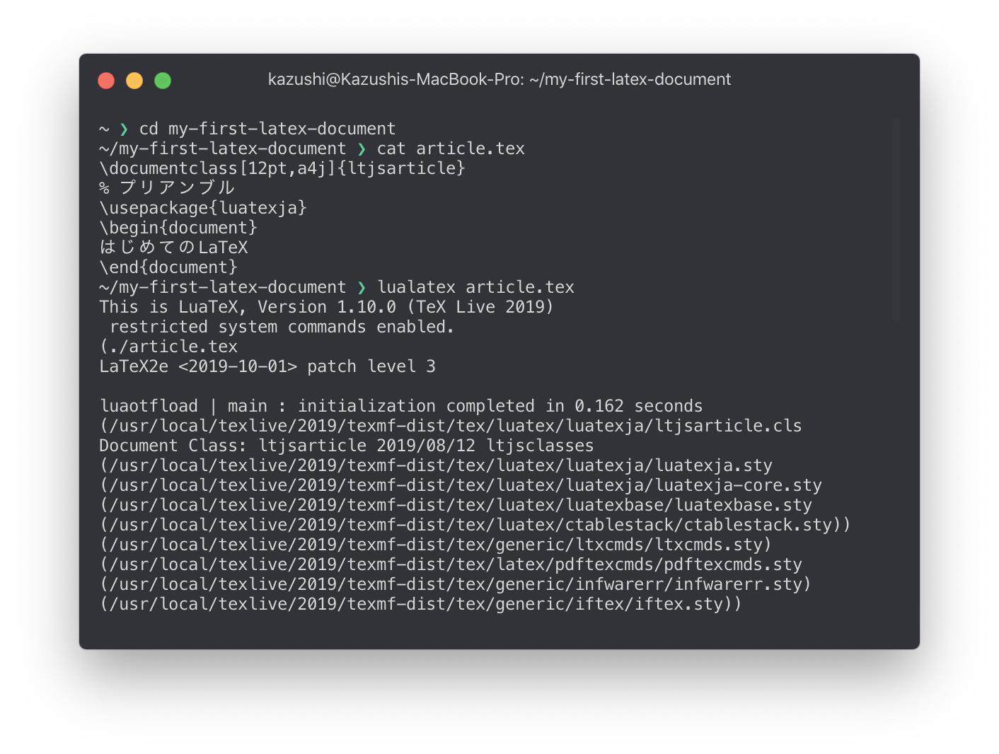
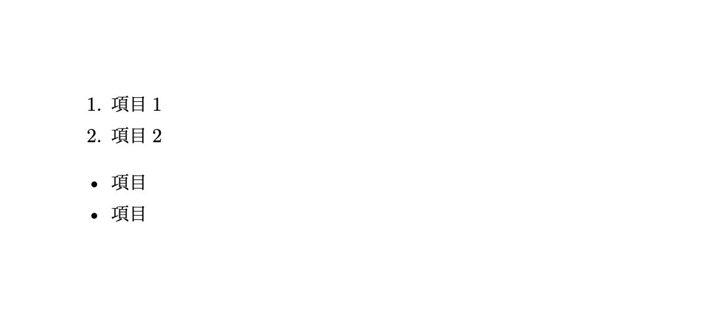
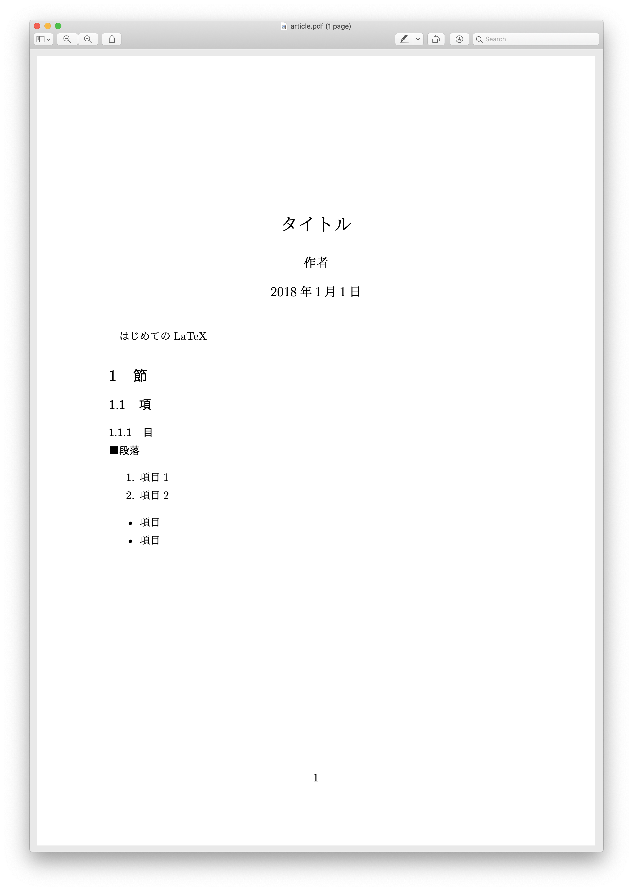

## はじめに

[はじめに](/latex/introduction/)で書いたように、以降ではLuaLaTeXの使用を前提とします。

まずは、最低限のソースファイルを作ってみます。仮に`article.tex`として、下の内容でテキストファイルを作成します。

```latex
\documentclass[12pt,a4j]{ltjsarticle}
% プリアンブル
\usepackage{luatexja}
\begin{document}
はじめてのLaTeX
\end{document}
```
基本的な構成は`html`などと変わりません。`\begin{document}`以前が`<head>`に相当するプリアンブル、`\begin{document} \end{document}`で囲まれた部分が`<body>`に相当します。
保存したディレクトリで`$ lualatex article`を実行すると`article.pdf`をはじめとしたファイルが作成されます。



`article.pdf`は次の画像のようになっているはずです。


今後はこのファイルに追記していきます。

## タイトル

`\begin{document}`の直後に
```latex
\title{タイトル}
\author{作者}
\date{2018年1月1日}
\maketitle
```
と入力してみましょう。

`\maketitle`コマンドを書くことによって実際にタイトルが生成されます。そのため、`\maketitle`がない場合にはタイトルは表示されません。`\date{}`コマンドによって日付を記入できます。`\date{\today}`で今日の日付を自動的に出力することもできます。[^1]

`\thanks{}`コマンドを使うことで、所属などを脚注として追加できます。

## 見出し

主に使うのは以下のコマンドだと思います。

```latex
\section{} % 節
\subsection{} % 項
\subsubsection{} % 目
\paragraph{} % 段落
```

それぞれの`{}`の中に見出しの文字列を指定します。

## 箇条書き

```latex
\begin{enumerate} % 順序ありのリスト
\item 項目1
\item 項目2
\end{enumerate}

\begin{itemize} % 順序なしのリスト
\item 項目
\item 項目
\end{itemize}
```

この出力結果は次のようになります。



箇条書きのスタイルを変更するには、プリアンブルに`\usepackage{enumitem}`を追加したうえで、オプションを
```latex
\begin{enumerate}[label=\textbf{\arabic*}, leftmargin=*]
```
のように指定します。

## 作成例

以上の結果を踏まえて、ファイルを作成してみました。ソースコードは次の通りです。

```latex
\documentclass[12pt,a4j]{ltjsarticle}
% プリアンブル
\usepackage{luatexja}
\begin{document}
\title{タイトル}
\author{作者}
\date{2018年1月1日}
\maketitle

はじめてのLaTeX

\section{節} % 節
\subsection{項} % 項
\subsubsection{目} % 目
\paragraph{段落} % 段落

\begin{enumerate} % 順序ありのリスト
\item 項目1
\item 項目2
\end{enumerate}

\begin{itemize} % 順序なしのリスト
\item 項目
\item 項目
\end{itemize}
\end{document}
```
このファイルからPDFを生成すると、次のような結果が得られます。




[^1]: `\date{}`コマンドを省略した場合にも同じように今日の日付が出力されます。
