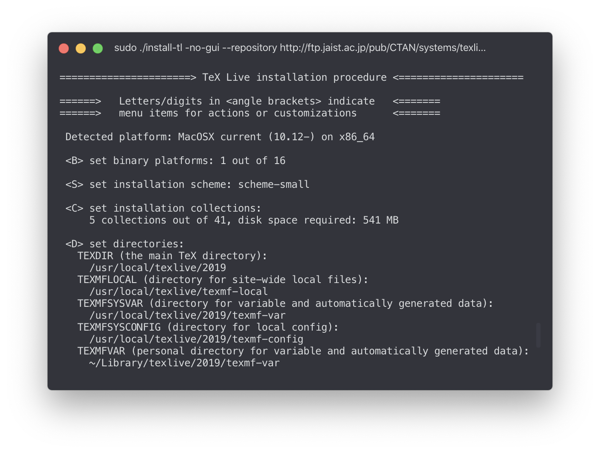
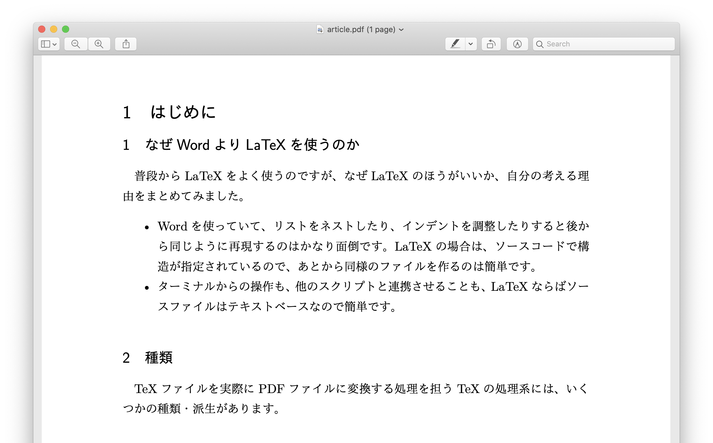
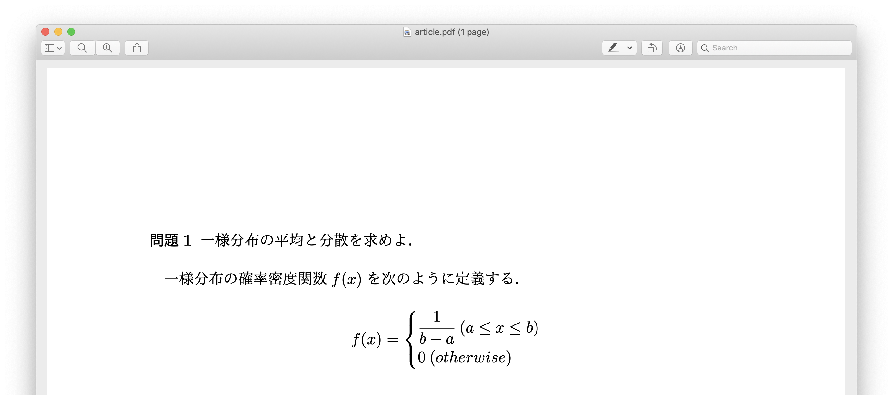
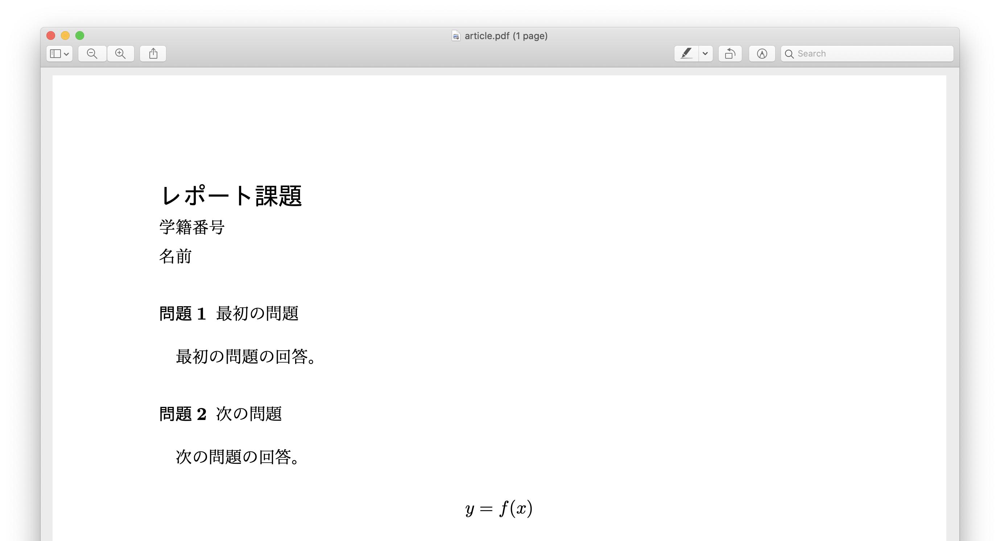

## はじめに

LaTeXをつかうときには簡単なことを実現するためにも検索に時間を費やしている気がするので、セットアップの方法や自分がよく使う機能をまとめます。

## 種類

TeXファイルを実際にPDFファイルに変換する処理を担うTeXの処理系には、いくつかの種類・派生があります。詳しくは[こちらの記事](https://qiita.com/yyu/items/6404656f822ce14db935)がわかりやすいですが、upTeX、LuaTeXなど複数のバージョンがあります。そのなかでPDFへの書き出しができかつ将来性がありそうなLuaTeXを使います。LuaTeXの使用を前提に書きますが、多くの操作は他の種類にも共通します。

## セットアップ

LaTeXを使い始めるのに二つのものが必要です。

- TeXのソースファイル
- それを処理する任意のTeX処理系

多くのチュートリアルでは、LaTeXの統合環境をインストールすることを勧めています、しかし統合環境を入れることは必須ではなく、自分の好きなエディタと、TeX処理系だけで十分に使えます。

### Linux

Linuxでは、各ディストリビューションのパッケージマネージャ(ex. `yum`, `apt`)が提供しているLaTeXのパッケージを利用することもできますが、LaTeXの各種設定を変更できるパッケージを管理・利用する都合上、TeX Liveを使うことをおすすめです。TeX Liveを使うことによって、`tlmgr`でTeXのパッケージを管理することができます。

ここではArch Linuxを例に説明しますが、ほかのディストリビューションでも概ね同じ方法でインストールが可能です。

#### TeX関連のパッケージをpacmanの管理下からはず

パッケージマネージャとTeX Liveが干渉してしまうため、TeX関連のパッケージについてはOSのパッケージマネージャに管理されないようにする必要があります。[TeX Wiki](https://texwiki.texjp.org/?texlive-dummy#archlinux)によると、

> Linux で TeX Live 公式パッケージをインストールした場合は TeX Live に依存するパッケージによって各種 Linux ディストリビューションが提供している TeX Live がインストールされないように TeX Live の dummy パッケージをインストールします。

dummyパッケージを導入することによってTeX関連のパッケージがpacmanに管理されないようにする方法が紹介されています。dummyパッケージについてはあまりスマートな解決方法ではないため、議論の結果現在はAURから削除されているようです。ここでは `pacman --assume-installed`を使ってを解決しました。

[texlive-dummyのソースコード](https://github.com/zhou13/aur/blob/master/texlive-dummy/PKGBUILD)を見てみると、

```:PKGBUILD
conflicts=('texlive-bin' $(pacman -Sgq texlive-most texlive-lang))
provides=('texlive-bin' $(pacman -Sgq texlive-most texlive-lang))
```

この部分で調整しているようなので、texlive 関連のパッケージが常にpacmanに無視されるように以下を`~/.bashrc`に追加しました。

```
alias pacman="pacman --assume-installed texlive-bin $(\pacman -Sgq texlive-most texlive-lang)"
```

読み込むために一度ターミナルで`$ source ~/.bashrc`を実行します。

#### インストーラの実行

インストーラをダウンロードして実行します。

```bash
curl -OL http://mirror.ctan.org/systems/texlive/tlnet/install-tl-unx.tar.gz
tar xvf install-tl-unx.tar.gz
cd install-tl-20*
sudo ./install-tl -no-gui --repository http://ftp.jaist.ac.jp/pub/CTAN/systems/texlive/tlnet/
```

インストーラにしたがって、オプションを選択します。普段使っているMacのBasicTeXに準じている`small scheme`を選びました。他のオプションはそのままでインストールします。

インストーラの動作が終了したらしたら、パスを通して、日本語環境とghostscriptをインストールします。

```bash
sudo /usr/local/texlive/????/bin/*/tlmgr path add
sudo tlmgr update --self -all
sudo tlmgr install collection-langjapanese
sudo pacman -S ghostscript
```

### macOS

`MacTeX`の使う例が多いですが、ここでも、Linuxの場合同様にTeX Liveを使ってインストールします。

#### インストーラの実行

インストーラをダウンロードして実行します。

```bash
curl -OL http://mirror.ctan.org/systems/texlive/tlnet/install-tl-unx.tar.gz
tar xvf install-tl-unx.tar.gz
cd install-tl-20*
sudo ./install-tl -no-gui --repository http://ftp.jaist.ac.jp/pub/CTAN/systems/texlive/tlnet/
```

インストーラにしたがって、オプションを選択します。MacのBasicTeXに準じている`small scheme`を選びました。他のオプションはそのままでインストールします。



インストーラの動作が終了したらしたら、パスを通して、日本語環境とインストールして完了です。

```bash
sudo /usr/local/texlive/????/bin/*/tlmgr path add
sudo tlmgr update --self -all
sudo tlmgr install collection-langjapanese
```

### TeX Live Manager `tlmgr` を使う

インストールが完了すると、TeXで使うパッケージの管理ツール`tlmgr`使えるようになります。これによって、パッケージの追加やアップデートが実行できまうs。

ソースファイルのヘッダーでパッケージを読み込みます。

```latex
\usepackage{enumitem}
```

パッケージが存在しない場合にはコンパイル時にエラーが発生します。

```
! LaTeX Error: File `enumitem.sty' not found.

Type X to quit or <RETURN> to proceed,
or enter new name. (Default extension: sty)
```

パッケージの追加は以下のコマンドで行います。

```bash
sudo tlmgr install enumitem
```

## よく使う設定

### ヘッダー・ページ番号

ヘッダーの設定を変更するには、プリアンブルで`\pagestyle`コマンドを、特定のページのみのヘッダー設定を変更するには`\thispagestyle`コマンドを用います。

共通して利用できるオプションは以下の通りです。

| オプション | 説明                           |
| ---------- | ------------------------------ |
| empty      | ページ番号含めなにも表示しない |
| plain      | ページ番号のみ表示する         |
| headings   | 既定のヘッダー                 |
| myheadings | 自分でカスタマイズしたヘッダー |

例えば全てのページにページ番号のみを表示する場合には、プリアンブルに

```latex
\pagestyle{plain}
```

と記述します。`\pagestyle{myheadings}`を選んだ場合には、`\markright{右ページのヘッダー}`や`\markleft{左ページのヘッダー}`コマンドを用いて左右いづれかのヘッダーのみを指定するか、`\markboth{左ページのヘッダー}{右ページのヘッダー}`コマンドで左右両方のヘッダーを指定します。

### ページ余白の設定

普段よく使う四方25mmのマージンに設定するには、

```latex
% 縦
\setlength{\textheight}{\paperheight} % 本文の高さを紙面の高さにする
\setlength{\topmargin}{-0.4truemm}
% もともとLaTeXでは上からのオフセットが1インチに設定されているので、それを25mmにする。
\addtolength{\topmargin}{-\headheight}
\addtolength{\topmargin}{-\headsep} % ヘッダーの分を上のマージンから減らす。
\addtolength{\textheight}{-50truemm} % 本文の高さから50mm引く
% 横
\setlength{\textwidth}{\paperwidth} % 本文の幅を紙面の高さにする
\setlength{\oddsidemargin}{-0.4truemm} % 左からのオフセットを25mmになおす。
\setlength{\evensidemargin}{-0.4truemm} % 左からのオフセットを25mmになおす。
\addtolength{\textwidth}{-50truemm} % 本文の幅から50mm引く
```

と記述します。

### 見出し

見出しのスタイルを変更したい時には、`\renewcommand`コマンドを使うことができます。試しに次の行をプリアンブルに追加してみます。

```
\renewcommand{\thesubsection}{\arabic{subsection}}
```

これによって通常1.1などと表示される`subsection`の見出しに`section`の番号(1.1の1.の部分)を表示させないようにすることができます。

`\renewcommand`に続く最初の`{}`で`\the`を追加した見出しの種類を記述し、どの見出しのスタイルを変更するかを指定します。続く`{}`で、実際の書式を設定します。例の`\arabic`だけでなく、次のオプションがあります。

| コマンド  | 形式           | 例           |
| --------- | -------------- | ------------ |
| `\arabic` | アラビア数字   | 1, 2, 3, ... |
| `\roman`  | ローマ数字     | ⅰ, ⅱ, ⅲ, ... |
| `\Roman`  | ローマ数字     | Ⅰ, Ⅱ, Ⅲ, ... |
| `\alph`   | アルファベット | a, b, c, ... |
| `\Alph`   | アルファベット | A, B, C, ... |

`\arabic`などのコマンドに囲まれた部分にはカウンタを指定します。カウンタとはTeXで見出しの番号が入っている変数のようなものです。見出しのタイプを指定することができます。

さきほどの例を見てみましょう。

```latex
\documentclass[12pt,a4j]{ltjsarticle}
\usepackage{luatexja}
\renewcommand{\thesubsection}{\arabic{subsection}}

\begin{document}

\section{はじめに}

\subsection{なぜWordよりLaTeXを使うのか}

普段からLaTeXをよく使うのですが、なぜLaTeXのほうがいいか、自分の考える理由をまとめてみました。

\begin{itemize}
\item Wordを使っていて、リストをネストしたり、インデントを調整したりすると後から同じように再現するのはかなり面倒です。LaTeXの場合は、ソースコードで構造が指定されているので、あとから同様のファイルを作るのは簡単です。
\item ターミナルからの操作も、他のスクリプトと連携させることも、LaTeXならばソースファイルはテキストベースなので簡単です。
\end{itemize}

\subsection{種類}

TeXファイルを実際にPDFファイルに変換する処理を担うTeXの処理系には、いくつかの種類・派生があります。

\end{document}
```

このようなドキュメントを作成し、PDFを出力すると、次のような結果が得られます。`subsection`は本来`1.1`のように、`section`の番号も入りますが、`\renewcommand` を用いたことによって、その表示を消すことができました。



### 見出しをさらにカスタマイズする

見出しをさらにカスタマイズするには、`titlesec`パッケージを利用します。はじめにインストールします。

```bash
sudo tlmgr install titlesec
```

その後、プリアンブルにカスタマイズする見出しの設定を記述します。

```latex
\usepackage{titlesec}
\titleformat{\section}[block]{\normalsize}{\textbf{問題\thesection}}{0.5em}{}
```

上の例では、`section`の見出しを変更して、問題文の表示に使っています。

この例を含むソースファイル

```latex
\documentclass[12pt,a4j]{ltjsarticle}
\usepackage{luatexja}
\usepackage{amsmath,amssymb} % 数式表示のため
\usepackage{titlesec}

\titleformat{\section}[block]{\normalsize}{\textbf{問題\thesection}}{0.5em}{}

\begin{document}

\section{一様分布の平均と分散を求めよ． }

一様分布の確率密度関数\( f(x) \)を次のように定義する．

\[
f(x)= \left\{
    \begin{aligned}
        &\frac{1}{b-a} \: (a \leq x \leq b) \\
        & 0 \: (otherwise)
    \end{aligned}
\right.
\]

% 以下略

\section{}
\end{document}
```

からPDFを出力すると、つぎのような結果が得られます。



### 箇条書き

箇条書きのスタイルを変更するには、`enumitem` を使うことができます。このパッケージを用いることで、見出しの行頭文字や、マージンを変更することが可能です。

プリアンブルに以下のコードを追加します。

```latex
\usepackage{enumitem}
```

箇条書きを書いてみました。

```latex
\begin{enumerate}[label=\textbf{\alph*}]
\item 項目
\item 項目
\item 項目
\end{enumerate}
```

このコードの出力結果は、次のようになります。


## 短いレポート

私が普段短いレポート課題を提出するときに使う設定をまとめたボイラープレートです。

```latex
\documentclass[12pt,a4j]{ltjsarticle}
\usepackage{amsmath,amssymb}
\usepackage{luatexja}
\usepackage{enumitem}
\usepackage{titlesec}

\pagestyle{plain}
\setlength{\textheight}{\paperheight}
\setlength{\topmargin}{-0.4truemm}
\addtolength{\topmargin}{-\headheight}
\addtolength{\topmargin}{-\headsep}
\addtolength{\textheight}{-50truemm}
\setlength{\textwidth}{\paperwidth}
\setlength{\oddsidemargin}{-0.4truemm}
\setlength{\evensidemargin}{-0.4truemm}
\addtolength{\textwidth}{-50truemm}

\titleformat{\section}[block]{\normalsize}{\textbf{問題\thesection}}{0.5em}{}

\begin{document}
{\bfseries\noindent\Large レポート課題}

\noindent 学籍番号\\
名前

\section{最初の問題}

最初の問題の回答。

\section{次の問題}

次の問題の回答。

\[
    y = f(x) % 適当な数式
\]

\end{document}
```

このファイルを出力すると、次のような結果が得られます。



---

### 参考

- [Linux - TeX Wiki](https://texwiki.texjp.org/?Linux#texliveinstall)
- [TeX Live/Mac - TeX Wiki](https://texwiki.texjp.org/?TeX%20Live%2FMac#texlive-install-official)
