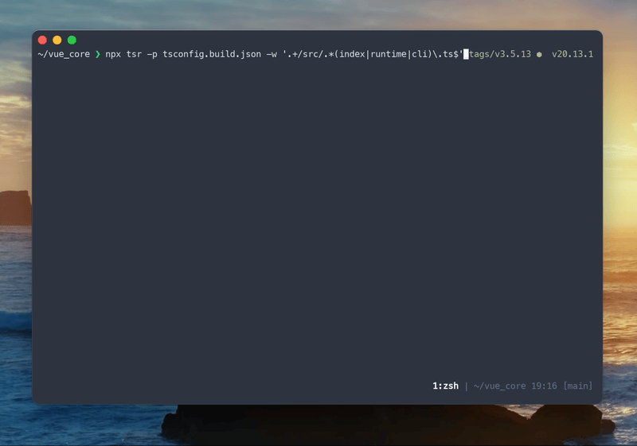

## TL;DR

Large projects developed and maintained long term often face growing codebase complexity and size. While this may be inevitable to handle the added features and changing requirements, many parts of the codebase may be actually unused and have no effect in the final output or the behavior of the application.

It's important to remove unused code as it results in increased cognitive load with negative impact for readability. You might end up spending more time in development to modify unused parts of your codebase.

Increase of unused code is a common issue seen across large-scale projects. However, the task of removing unused code is quite tedious. TypeScript Remove (tsr) is a command line tool that helps you to remove unused code by detecting unused code and automatically editing source files.

https://github.com/tsrorg/tsr

## The problem

In most projects, code execution begins from an entry file. For example, let's consider a project where `src/main.ts` serves as the entry point and has a single module dependency, `src/utils.ts`.

```typescript
// src/main.ts

import { f } from './utils.js';

f();
```

```typescript
// src/utils.ts

export function f() {
  console.log('f');
}

// not used
export function g() {
  console.log('g');
}
```

In a small project with just two files, it's obvious that `g()` is unused. However, as the project grows in size, the dependency graph of modules will become exponentially complex.

Unused `export`s can be identified by checking on each declaration in each file step-by-step using VSCode's TypeScript integration. However the real challenge is when these exports and imports form a dependency graph that is not connected to the dependency graph which is traceable from the entry point. In such cases, removing dead code is almost impossible to execute manually.

Modern bundlers like Vite use static analysis methods on your codebase to perform tree-shaking, excluding unreachable code from the generated bundle. While there's much attention towards not including dead code in the generated bundle, that is not the case for removing unused code in your source files.

## TypeScript Remove (tsr)

TypeScript Remove (tsr) is a tool that addresses this issue. It will detect and remove unused code automatically from your project. Notable features include:

- Accuracy: tsr utilizes custom logic to analyze usage of exports rather than depending on `ts.LanguageSerivce.findReferences` as seen in other tools. It avoids the necessity of multiple hacks and workarounds required to bypass the limitations. For example, handling `export * from './foo';` correctly requires many hacks if you try to implement a tool with TypeScript's internal API.
- Performance: tsr can handle large-scale projects fast. Benchmarks show that the execution will take around 700ms for `vuejs/core` on a Mac mini (2024).
- Minimal Design: tsr is zero-config and uses `tsconfig.json`. Detecting the scope of the project and the module resolution behavior is controlled by `tsconfig.json`, making tsr simple while also being predictable. If your project passes type checking with `tsc`, tsr will work; If type checking fails, tsr will not give the expected results.

Here are some scenarios where tsr might be useful:

- Detecting the current state of dead code in your TypeScript project
- Executing tsr before creating a Pull-Request to remove unused code that you may have added when implementing a feature
- Adding tsr to your CI pipeline to ensure that unused code will not be merged in to your main branch

and so on!

The following sections will cover how to use tsr by applying it to an example, the `vuejs/core` repository.[^vue]

[^vue]: While this example uses the Vue.js core repository, tsr currently does not handle single file components (SFCs). The `vuejs/core` repository was chosen because it’s a large-scale project written purely in TypeScript.

## Setup

First, clone and setup the `vuejs/core` repository.

```bash
git clone --depth=1 -b v3.5.13 git@github.com:vuejs/core.git vue_core
cd vue_core
```

## Detect

In order to use tsr, you need to identify the entry point files. Without these files, all modules in the project are considered unnecessary.

In the case of `vuejs/core`, a monorepo setup, the entry files match the following glob pattern:

- `packages/*/src/index.ts`
- `packages/*/src/runtime.ts`
- `packages/*/src/cli.ts`

For example, the entry point for the `compiler-core` package is `packages/compiler-core/src/index.ts`.

tsr requires a regular expression that matches your entry point files. For `vuejs/core`, the following command can be used in the monorepo root.

```bash
npx tsr -p tsconfig.build.json '.+/src/.*(index|runtime|cli)\.ts$'
```


The command will detect unused exports and unused files across the project.

## Remove

By adding the `-w` or `--write` option, tsr will automatically edit files to remove unused code.

```bash
npx tsr -p tsconfig.build.json -w '.+/src/.*(index|runtime|cli)\.ts$'
```



If you run a type check with TypeScript's `tsc` command, no errors will be reported, meaning that tsr can safely edit your files.[^side-effect]

[^side-effect]: tsr assumes that modules other than entry points have no side effects. It's common that this is true (for instance if you're developing a React app), but it's better to review the changes made by tsr before deploying to production for added safety.

```bash
npx tsc -p tsconfig.build.json --noEmit
## no errors
```

## Observing the changes

Here are some examples of the edits made by tsr:

```diff
diff --git a/packages/shared/src/globalsAllowList.ts b/packages/shared/src/globalsAllowList.ts
index 3b584cc..81543b3 100644
--- a/packages/shared/src/globalsAllowList.ts
+++ b/packages/shared/src/globalsAllowList.ts
@@ -7,6 +7,3 @@ const GLOBALS_ALLOWED =

 export const isGloballyAllowed: (key: string) => boolean =
   /*@__PURE__*/ makeMap(GLOBALS_ALLOWED)
-
-/** @deprecated use `isGloballyAllowed` instead */
-export const isGloballyWhitelisted: (key: string) => boolean = isGloballyAllowed
```

```diff
diff --git a/packages/compiler-ssr/src/errors.ts b/packages/compiler-ssr/src/errors.ts
index e4fd505..0e22233 100644
--- a/packages/compiler-ssr/src/errors.ts
+++ b/packages/compiler-ssr/src/errors.ts
@@ -5,7 +5,7 @@ import {
   createCompilerError,
 } from '@vue/compiler-dom'

-export interface SSRCompilerError extends CompilerError {
+interface SSRCompilerError extends CompilerError {
   code: SSRErrorCodes
 }

@@ -35,7 +35,7 @@ if (__TEST__) {
   }
 }

-export const SSRErrorMessages: { [code: number]: string } = {
+const SSRErrorMessages: { [code: number]: string } = {
   [SSRErrorCodes.X_SSR_UNSAFE_ATTR_NAME]: `Unsafe attribute name for SSR.`,
   [SSRErrorCodes.X_SSR_NO_TELEPORT_TARGET]: `Missing the 'to' prop on teleport element.`,
   [SSRErrorCodes.X_SSR_INVALID_AST_NODE]: `Invalid AST node during SSR transform.`,
```

tsr distinguishes between fully unused definitions (which it deletes) and those used within the file (where it removes just the `export` keyword). tsr will also remove unused imports or definitions that occur as a result of removing the unused exports.

## Final note

With TypeScript Remove (tsr), removing dead code for your TypeScript project becomes simple. I've been using it for a while and has been a refreshing experience to discover the accumulated dead code that exists in a project. It's also been helpful to refactor and rewrite large chunks of code because it helps me to focus on updating the logic and leave code deletion to tsr.

If you like this tool, please consider giving the project a star on Github. ⭐️ Happy hacking!

https://github.com/tsrorg/tsr
