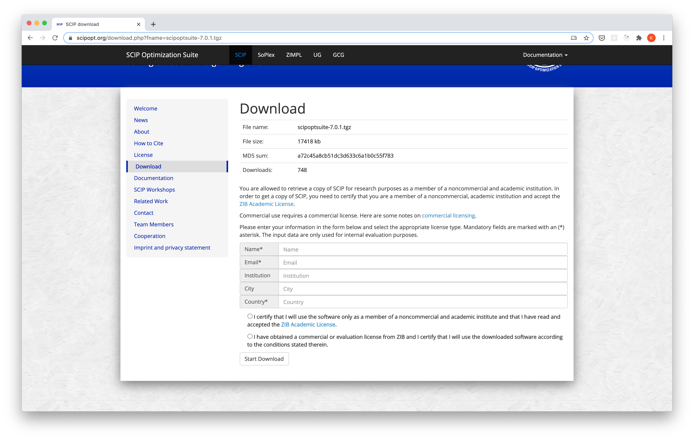

## TL;DR

最適化ソルバーSCIPとPythonベースのモデリング言語をPyomoを使ってPython上で最適化問題を解く方法をまとめました。Macでのインストールを想定していますが、UNIXライクなOSであれば、ほぼほぼ同じ手順で再現できると思います。

## SCIP とは

> SCIP is currently one of the fastest non-commercial solvers for mixed integer programming (MIP) and mixed integer nonlinear programming (MINLP). It is also a framework for constraint integer programming and branch-cut-and-price. It allows for total control of the solution process and the access of detailed information down to the guts of the solver.

[公式サイト](https://www.scipopt.org/)より

との通り、SCIPは非商用・無料で使える高速な最適化ソルバーです。混合整数計画問題と混合整数非線形計画問題に対応しています。

## Pyomo とは

> Pyomo is a Python-based open-source software package that supports a diverse set of optimization capabilities for formulating and analyzing optimization models.

[Github](https://github.com/Pyomo/pyomo)より

との通り、PyomoはPythonのライブラリで、最適化問題の記述を行うことができます。

Pythonで最適化問題を解くためには、Pyomoによってモデルを記述した上で、SCIPのソルバーを使って実際に問題を解きます。SCIPはネイティブコードとして実行されるので、Python上のPyomoとSCIPのやりとりのためにAMPLというモデリング言語がインタフェースの役割を果たします。（このAMPLの役割の理解にはあまり自信がありません...）


## 環境

以降インストールを行なった環境は次の通りです。

- macOS 10.15.6
- Python 3.8.2

また最終的にインストールされたパッケージのバージョンは次の通りです。

- Pyomo 5.7
- SCIP 7.0.1

## SCIP のインストール

### ダウンロード

https://www.scipopt.org/index.php#download より、SCIPのOSとバージョンを選択して、プルダウンの下にある `scipoptsuite-{version}.tgz` のリンクをクリックします。


クリックすると、商用目的の利用ではないことを確認するチェックボックスと利用者の名前などの入力を促すページに遷移するので、入力を行いダウンロードします。



### ビルド

以下の手順でSCIP-AMPLバイナリをビルドします。

```bash
brew install boost ## コンパイルの依存ライブラリをインストール
tar xzf scipoptsuite-7.0.1.tgz ## 展開
cd scipoptsuite-7.0.1

make ## ビルド

## 以下AMPLのビルドを行います
cd scip/interfaces/ampl
./get.ASL
cd solvers/
sh configurehere
make
cd ..

## SCIP-AMPL インタフェースのビルド
make
## PATH配下の任意のディレクトリにバイナリをコピー
sudo cp bin/scipampl /usr/local/bin/
```

## Pyomo のインストール

[Poetry を使ってPythonの依存をきちんと管理したい](./setup-a-python-project#poetry%E3%81%A7%E4%BE%9D%E5%AD%98%E3%83%A9%E3%82%A4%E3%83%96%E3%83%A9%E3%83%AA%E3%82%92%E7%AE%A1%E7%90%86%E3%81%99%E3%82%8B)ので、以下ではPoetryプロジェクトを作成して話を進めますが、特に気にしなければ

```bash
pip install pyomo
```

でも問題なくPyomoをインストールできるはずです。

### Poetry プロジェクトを作る

```bash
mkdir scip-pyomo-project ## 適当なプロジェクトディレクトリを作る
cd scip-pyomo-project
poetry init ## プロジェクトの初期化
poetry add pyomo ## pyomo の追加
```

## 最適化問題を解いてみる

[Gurobiを使った例](./install-gurobi-on-mac#%E8%A9%A6%E3%81%97%E3%81%AB%E7%B0%A1%E5%8D%98%E3%81%AA%E6%9C%80%E9%81%A9%E5%8C%96%E5%95%8F%E9%A1%8C%E3%82%92%E8%A7%A3%E3%81%8F)と同様に、久保 幹雄、ジョア・ペドロ・ペドロソ、村松 正和、アブドル・レイス『あたらしい数理最適化: Python言語とGurobiで解く』より、1章2節の線形計画問題を解いてみます。

$$
\begin{array}{crc}
\text{maximize} & 15 x_1 + 18 x_2 + 30 x_3 & \\
\text{subject to} & 2 x_1 + x_2 + x_3 &\leq 60 \\
& x_1 + 2x_2 + x_3 &\leq 60 \\
& x_3 &\leq 30 \\
& x_1, x_2, x_3 &\geq 0
\end{array}
$$

### ソースコード

次のコードを書いてみました。

```python
from pyomo.environ import *
from pyomo.opt import SolverFactory

Model = ConcreteModel("Sample")


Model.x1 = Var(within=NonNegativeReals)
Model.x2 = Var(within=NonNegativeReals)
Model.x3 = Var(within=NonNegativeReals)


def const_1(model):
    return 2 * Model.x1 + Model.x2 + Model.x3 <= 60


def const_2(model):
    return Model.x1 + 2 * Model.x2 + Model.x3 <= 60


def const_3(model):
    return Model.x3 <= 30


Model.const_1 = Constraint(rule=const_1)
Model.const_2 = Constraint(rule=const_2)
Model.const_3 = Constraint(rule=const_3)


def objective(model):
    return 15 * Model.x1 + 18 * Model.x2 + 30 * Model.x3


Model.value = Objective(rule=objective, sense=maximize)

opt = SolverFactory("scipampl")
result = opt.solve(Model, tee=True)
Model.display()
```

### 実行結果

`poetry shell` でvenvに入り、これを実行した結果が次の通りです。

```
SCIP version 7.0.1 [precision: 8 byte] [memory: block] [mode: optimized] [LP solver: SoPlex 5.0.1] [GitHash: b41d526acf]
Copyright (C) 2002-2020 Konrad-Zuse-Zentrum fuer Informationstechnik Berlin (ZIB)

External codes: 
  Readline EditLine w  GNU library for command line editing (gnu.org/s/readline)
  SoPlex 5.0.1         Linear Programming Solver developed at Zuse Institute Berlin (soplex.zib.de) [GitHash: fcd2a2a5]
  CppAD 20180000.0     Algorithmic Differentiation of C++ algorithms developed by B. Bell (www.coin-or.org/CppAD)
  ZLIB 1.2.11          General purpose compression library by J. Gailly and M. Adler (zlib.net)
  GMP 6.2.0            GNU Multiple Precision Arithmetic Library developed by T. Granlund (gmplib.org)
  ASL                  AMPL Solver Library developed by D. Gay (www.netlib.com/ampl)


number of parameters = 2607
non-default parameter settings:


read problem </var/folders/0f/8jnb3zsx6055b_cgy_456nc80000gn/T/tmpox_uunep.pyomo.nl>
============

original problem has 3 variables (0 bin, 0 int, 0 impl, 3 cont) and 3 constraints

1/1 feasible solution given by solution candidate storage, new primal bound 0.000000e+00

presolving:
(round 1, fast)       0 del vars, 1 del conss, 0 add conss, 5 chg bounds, 0 chg sides, 0 chg coeffs, 0 upgd conss, 0 impls, 0 clqs
   Deactivated symmetry handling methods, since SCIP was built without symmetry detector (SYM=none).
presolving (2 rounds: 2 fast, 1 medium, 1 exhaustive):
 0 deleted vars, 1 deleted constraints, 0 added constraints, 5 tightened bounds, 0 added holes, 0 changed sides, 0 changed coefficients
 0 implications, 0 cliques
presolved problem has 3 variables (0 bin, 0 int, 0 impl, 3 cont) and 2 constraints
      2 constraints of type <linear>
Presolving Time: 0.00
transformed 1/1 original solutions to the transformed problem space

 time | node  | left  |LP iter|LP it/n|mem/heur|mdpt |vars |cons |rows |cuts |sepa|confs|strbr|  dualbound   | primalbound  |  gap   | compl. 
* 0.0s|     1 |     0 |     2 |     - |    LP  |   0 |   3 |   2 |   2 |   0 |  0 |   0 |   0 | 1.230000e+03 | 1.230000e+03 |   0.00%| unknown
  0.0s|     1 |     0 |     2 |     - |   573k |   0 |   3 |   2 |   2 |   0 |  0 |   0 |   0 | 1.230000e+03 | 1.230000e+03 |   0.00%| unknown

SCIP Status        : problem is solved [optimal solution found]
Solving Time (sec) : 0.00
Solving Nodes      : 1
Primal Bound       : +1.23000000000000e+03 (2 solutions)
Dual Bound         : +1.23000000000000e+03
Gap                : 0.00 %

optimal solution found

Model Sample

  Variables:
    x1 : Size=1, Index=None
        Key  : Lower : Value : Upper : Fixed : Stale : Domain
        None :     0 :  10.0 :  None : False : False : NonNegativeReals
    x2 : Size=1, Index=None
        Key  : Lower : Value : Upper : Fixed : Stale : Domain
        None :     0 :  10.0 :  None : False : False : NonNegativeReals
    x3 : Size=1, Index=None
        Key  : Lower : Value : Upper : Fixed : Stale : Domain
        None :     0 :  30.0 :  None : False : False : NonNegativeReals

  Objectives:
    value : Size=1, Index=None, Active=True
        Key  : Active : Value
        None :   True : 1230.0

  Constraints:
    const_1 : Size=1
        Key  : Lower : Body : Upper
        None :  None : 60.0 :  60.0
    const_2 : Size=1
        Key  : Lower : Body : Upper
        None :  None : 60.0 :  60.0
    const_3 : Size=1
        Key  : Lower : Body : Upper
        None :  None : 30.0 :  30.0
```

Gurobiで実行した場合と同様に、$x_1 = 10, x_2 = 10, x_3 = 30$ のとき最大値 $1230$ を取ることが求まりました。

## Reference

- [Using SCIP with AMPL
](http://www.zverovich.net/2012/08/07/using-scip-with-ampl.html)
- [Python + Pyomoによる(非線形)数値最適化](http://ajhjhaf.hatenablog.com/entry/2018/02/12/235015)
